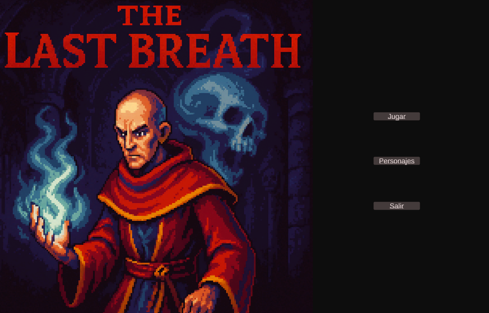
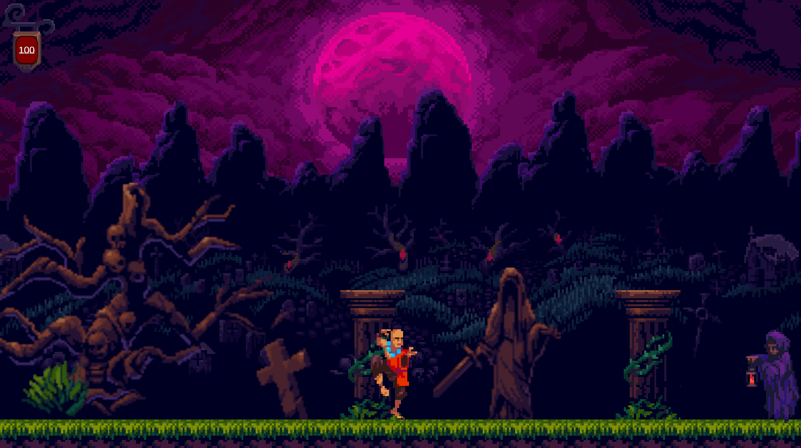
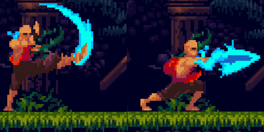
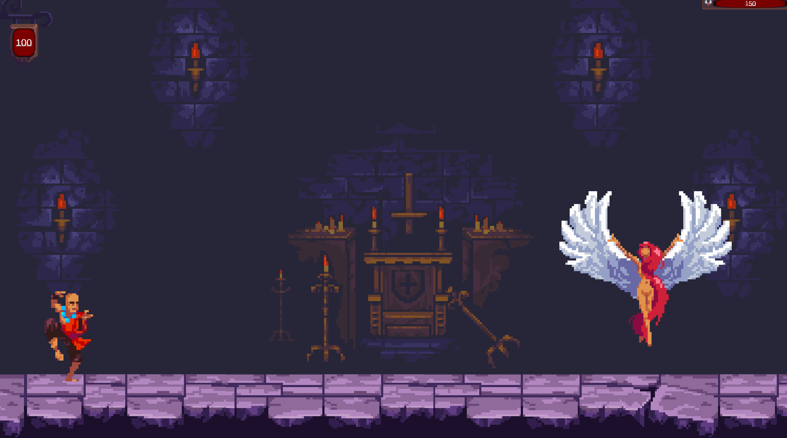

# 🎮 The Last Breath
### “La muerte no es el final”

Prototipo de videojuego 2D de acción y plataformas desarrollado en Unity como proyecto académico en el marco de una Game Jam con temática "La muerte no es el final".  
El juego sigue la historia de Abdul, un monje que, tras fallecer debe enfrentarse a sus propios pecados y enemigos para encontrar la paz definitiva.
Un proyecto centrado en gameplay, narrativa ambiental y diseño de niveles, con una estética oscura inspirada en clásicos del género.

## 📸 Gameplay
### Menú principal

### Nivel inicial

### Combate

### Boss

### Escena final

## Mi contribución
- Programación de mecánicas principales en C# (Unity).
- Diseño y estructuración de niveles.
- Implementación de UI y HUD
- Diseño de gameplay y narrativa.
- Testeo, balanceo y ajustes de experiencia de juego.

Proyecto realizado en colaboración de **Mario Santos Heredia** (programación, música y efectos visuales).

## Género y ambientación
- Acción / Plataformas 2D
- Estética gótica inspirada en juegos tipo *Castlevania* o *Blasphemous*

## Mecánicas principales
- Combate cuerpo a cuerpo (puñetazos, patadas, ataques en salto y agachado).
- Sistema de vida y daño.
- Enemigos con comportamiento básico.
- Progresión por niveles tipo plataformas.
- Sistema de muerte y reinicio.
- UI con HUD y menú de pausa.

## Objetivo del juego
Avanzar por los niveles derrotando enemigos y superando obstáculos para liberar el alma del protagonista y completar así su transito hacia el descanso final.

## Tecnologías
- Unity
- C#
- Diseño y animación 2D
- Integración de assets y gameplay scripting

## Aprendizajes clave
Este proyecto me permitió:
- Desarrollar mecánicas completas de gameplay en Unity.
- Trabajar el diseño y balanceo de niveles.
- Integrar narrativa dentro del gameplay.
- Coordinar trabajo colaborativo en proyectos Game Dev.
- Gestionar assets externos dentro de un proyecto real.

## Estado del proyecto
Prototipo académico finalizado. Totalmente jugable.
Posible evolución futura con nuevos niveles, IA enemiga avanzada, mayor profundidad narrativa, nuevos personajes y mejoras visuales y sonoras.

## Assets
Assets gráficos obtenidos de Unity Asset Store (autor: Ansimuz).

---

Si te interesa el desarrollo de videojuegos o quieres comentar el proyecto, **estaré encantada de conectar**.
